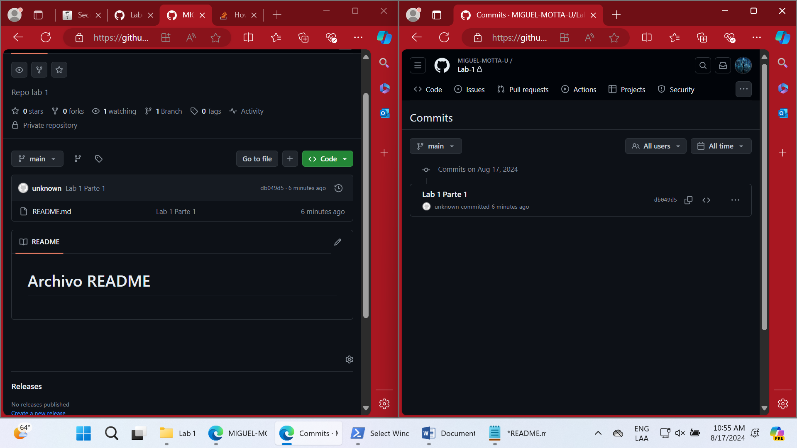

# Archivo README

## Parte 1

**Comandos**

El comando de [`git add .`](https://git-scm.com/docs/git-add) permite agregar modificaciones al repositorio local. Si se desea, se puede agregar contenido especifico de la siguiente manera:
> `git add README.md`

Si se hace  `git add .` se agregan todas las modificaciones al repositorio local, si se usa `git add (nombre arhcivo) ` solo se agrega la modificación del archivo especificada.

> Nota: `git add` no funciona para eliminar archivos en el repositorio local, solo modificaciones o archivos nuevos.

El commando de [`git commit -m (comentario)`](https://git-scm.com/docs/git-commit) permite capturar los cambios hechos en el historial de commits, lo que nos permite crear un punto de retorno en caso de ser necesario y restaurar el repositorio en un punto específico.

## Parte 2

Owner y Colaborador editan el archivo README.md al mismo tiempo e intentan subir los cambios al mismo tiempo.
¿Que sucedió?

Lo que sucedió fue que al owner se le subieron los cambios que realizó, pero al colaborador no le dejó debido a que los commits en el git 
estaban retrasados en un commit, por lo que se debia realizar primero un pull. Al hacer el pull decía que no era posible hacer el merge
debido a que habia conflictos en las ramas y, que se debian solucionar antes de hacer el push de nuevo.

## Parte 3

¿Hay una mejor forma de trabajar con git para no tener conflictos?
Sí. Una mejor forma es crear ramas para cada desarrolador donde este haga sus cambios sin afectar la rama principal.

¿Qué es  el Pull Request?
Un pull request es una solicitud a un repositorio para proponer cambios a los responsables de este.
¿cómo funciona?
Primero se crea una nueva rama en tu repositorio.
Realiza y confirma los cambios.
Crea una pull request desde Github, selecciona tu rama y describe la solicitud.
Después, el encargado realiza la revisión de tu pull request para denegarla o aceptarla.

